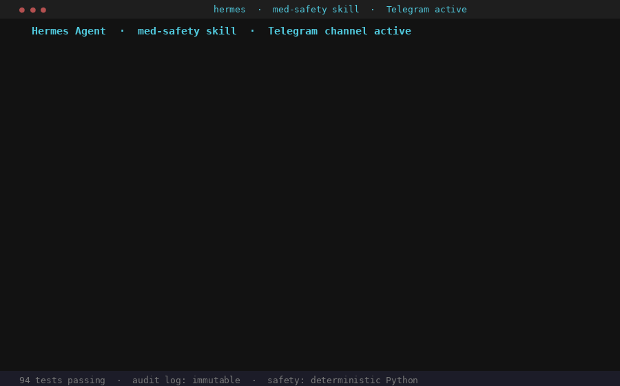
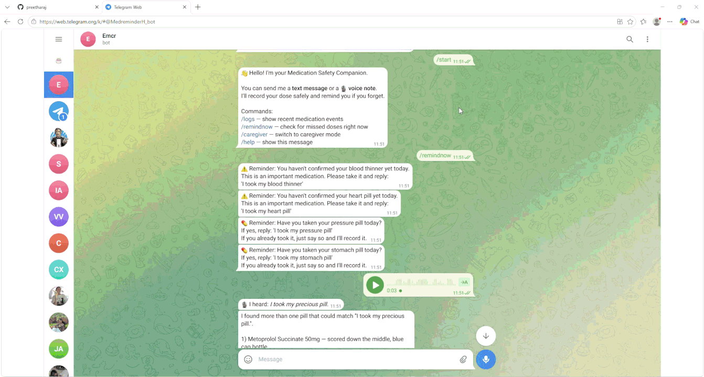

# 💊 Medication Safety Companion
### Built on Hermes Agent · Hermes Agent Challenge 2026

[](https://www.python.org/)
[](https://github.com/nousresearch/hermes-agent)
[](https://github.com/nousresearch/hermes-agent)
[](https://telegram.org/)
[](https://sqlite.org/)


> *"I think I took my blood thinner twice today. Or maybe I forgot it. I honestly can't remember."*
>
> — A real phone call. The reason this project exists.

Older adults managing multiple prescriptions face four recurring dangers: **forgetting** a dose, **confusing** similar-looking pills, **double-dosing** when memory fails, and **unsafe combinations** nobody warned them about. This project addresses all four — through Telegram, by voice or text, around the clock — powered by Hermes Agent as its orchestration backbone.

---

## ⚡ Hermes Is Not a Wrapper. It Is the Project.

> **Hermes handles the entire conversation. Python handles every safety decision. Neither does the other's job — and that boundary is what makes this safe enough to deploy.**

The patient never interacts with Python. They talk to Hermes through Telegram. Hermes receives their voice note, transcribes it locally, routes the transcript through the safety skill, reads the JSON result, and delivers the response — all without a single line of application code touching the conversation layer. The Python safety pipeline exists purely to answer one question: *is this action safe?* Hermes exists purely to ask that question on behalf of the patient and deliver the answer back.

Strip out Hermes and you have a Python script nobody can talk to. Strip out the safety pipeline and you have an LLM that might tell someone a double dose is probably fine. Both halves are essential. Neither can do the other's job.

---

## Demo

### CLI (`hermes -s med-safety`)

> 📽️ []

```
You:  I took my heart pill
Assistant: ✅ Got it. I've recorded that you took your heart pill at 08:14 UTC.
           You don't need to log it again today.

You:  the white pill
Assistant: 🔍 I found more than one pill that could match.
           1) Metoprolol 50mg  — white oval, blue cap bottle
           2) Lisinopril 10mg  — white round, orange bottle, morning dose
           3) Amlodipine 5mg   — white round, yellow bottle, evening dose
           Which one did you take?

You:  2
Assistant: ✅ Got it. I've recorded that you took your pressure pill at 08:17 UTC.

You:  I took my heart pill
Assistant: 🔒 I already have a record that you took your heart pill today at 08:14 UTC.
           You don't need to take it again.
           If you think there's a mistake, ask your caregiver to check.

You:  I want to take an old pain pill with my blood thinner
Assistant: ⛔ I need to stop here. That medication may not be safe to take
           alongside your current prescriptions. Please do not take it right now.
           Contact your doctor or pharmacist before taking anything new.
           I've made a note for your caregiver.

You:  I accidentally took too many pills
Assistant: 🚨 This sounds urgent. Please call 995 right now or ask someone
           nearby to call for you. Tell them which medication was taken
           and roughly how much. Do not take anything else until help arrives.

You:  logs
Assistant: 📋 Recent events:
           🚨 [2026-05-29 08:18] EMERGENCY_ESCALATION
           ⚠️  [2026-05-29 08:17] DRUG_INTERACTION_ALERT
           🔒 [2026-05-29 08:17] MED_DUPLICATE_BLOCKED — heart pill
           ✅  [2026-05-29 08:17] MED_CONFIRMED — pressure pill
           🔍 [2026-05-29 08:17] MED_AMBIGUOUS
           ✅  [2026-05-29 08:14] MED_CONFIRMED — heart pill
```

---

### Telegram Bot (`python cli.py --bot`)

> 📱 []
>
> *Bot: [@MedreminderH_bot](https://web.telegram.org/k/#@MedreminderH_bot)*

```
/start
→ 👋 Hello! I'm your Medication Safety Companion.
  You can send me a text message or a 🎙️ voice note.
  I'll record your dose safely and remind you if you forget.

  Commands:
  /logs       — show recent medication events
  /remindnow  — check for missed doses right now
  /caregiver  — switch to caregiver mode

🎙️ [voice note: "I took my heart pill"]
→ 🎙 I heard: I took my heart pill
→ ✅ Got it. I've recorded that you took your heart pill at 08:14 UTC.

🎙️ [voice note: "I accidentally took too many pills"]
→ 🎙 I heard: I accidentally took too many pills
→ 🚨 This sounds urgent. Please call 995 right now...

/remindnow
→ ⚠️ Reminder: You haven't confirmed your blood thinner yet today.
  This is an important medication. Please take it and reply:
  'I took my blood thinner'

/logs
→ 📋 Recent events:
  🚨 [2026-05-29 08:18] EMERGENCY_ESCALATION
  ✅  [2026-05-29 08:14] MED_CONFIRMED — heart pill
  ...
```

---

## How Hermes Makes This Work

### 1. Telegram Gateway + Voice Note Transcription
When a patient sends a voice note, Hermes's Telegram gateway receives it, downloads the audio, passes it through faster-whisper for local on-device transcription, and routes the transcript to the safety skill. The patient sent a voice message the same way they would to a family member. No app to install. No commands to learn.

### 2. Native Skill Orchestration (`SKILL.md` + `SOUL.md`)
The entire project is packaged as a Hermes skill. `SKILL.md` defines a step-by-step procedure Hermes follows on every turn — what to call, how to interpret each result, and hard rules it cannot break. `SOUL.md` defines the personality: calm, short sentences, everyday words, one clear next step. This consistency matters when the person reading the message is anxious about whether they double-dosed a blood thinner.

### 3. Terminal Tool — Clean Separation of AI and Safety Logic
Hermes calls `dispatch.py` via its terminal tool on every turn. The script runs the full deterministic safety pipeline and returns structured JSON. Hermes reads the `outcome` field and acts. It never decides whether a dose is safe or a combination is dangerous. Python already decided. Hermes delivers.

```json
{
  "outcome": "CONFIRMED",
  "message": "Got it. I've recorded that you took your heart pill at 08:14 UTC.",
  "session_key": null,
  "log_id": 7
}
```

### 4. Session Memory for Multi-Turn Conversations
When a patient says "the white pill" and three candidates match, the pipeline returns an `AMBIGUOUS` outcome with a `session_key`. Hermes holds that key in its session memory and passes it on the next turn automatically. No custom state store needed.

### 5. Cron Scheduler for Proactive Reminders
Every morning at the configured time, Hermes's cron scheduler runs `dispatch.py --remind`. The reminder engine checks each medication's scheduled time against the audit log and returns messages only for doses that are genuinely overdue. Hermes delivers them to Telegram — the patient receives a reminder without opening the app first.

### 6. Redundant JobQueue Backup
The Telegram bot also runs an independent 15-minute check via python-telegram-bot. If Hermes cron misses a window, the bot sends the reminder anyway. A medication reminder should not have a single point of failure.

---

## Architecture

```
┌─────────────────────────────────────────────────────────────────┐
│                        PATIENT / CAREGIVER                      │
│                   (Telegram — text or voice note)               │
└──────────────────────────────┬──────────────────────────────────┘
                               │
                               ▼
┌─────────────────────────────────────────────────────────────────┐
│                        HERMES AGENT                             │
│                                                                 │
│  • Telegram gateway    — receives messages and voice notes      │
│  • Voice transcription — faster-whisper (local, free, offline)  │
│  • SKILL.md            — orchestration rules and outcome logic  │
│  • SOUL.md             — calm, elderly-friendly personality     │
│  • Session memory      — tracks session_key across turns        │
│  • Cron scheduler      — proactive morning dose reminders       │
└──────────────────────────────┬──────────────────────────────────┘
                               │  terminal: python dispatch.py "..."
                               ▼
┌─────────────────────────────────────────────────────────────────┐
│                    SAFETY PIPELINE (Python)                     │
│              Deterministic — zero AI in safety decisions        │
│                                                                 │
│  safety_router.py                                               │
│    ├─ emergency_escalation.py  80+ keywords, fires first        │
│    ├─ confidence_rules.py      low STT → ask to repeat          │
│    ├─ lookup.py                4-pass medication matching       │
│    ├─ ambiguity_handler.py     2+ matches → clarification       │
│    └─ duplicate_guard.py       prior dose in window → block     │
│                                                                 │
│  Returns JSON: {outcome, message, session_key, log_id}          │
└──────────┬───────────────────────────────────────┬─────────────┘
           │ ESCALATION                             │ all other
           ▼                                        ▼
   Return verbatim                       OpenRouter rephrases into
   (LLM bypassed entirely)               SOUL.md-consistent language
           └───────────────────┬───────────────────┘
                               │
                               ▼
┌─────────────────────────────────────────────────────────────────┐
│                    SQLITE AUDIT LOG                             │
│         Immutable — no row ever deleted or modified             │
│  MED_CONFIRMED · MED_UNCERTAIN · MED_DUPLICATE_BLOCKED          │
│  MED_AMBIGUOUS · EMERGENCY_ESCALATION · DRUG_INTERACTION_ALERT  │
│  CAREGIVER_CORRECTION · MED_LOW_CONFIDENCE                      │
└─────────────────────────────────────────────────────────────────┘
```

**Escalation messages bypass the LLM entirely.** The moment the pipeline returns `ESCALATION`, the message goes straight to the patient. No model softens "call 995 right now."

---

## Features

| Feature | Detail |
|---|---|
| **Voice confirmation** | Send a Telegram voice note — transcribed locally, no audio leaves device |
| **Text confirmation** | "I took my heart pill", "I want to take my blood thinner" |
| **Ambiguity resolution** | "The white pill" → ask which one → confirm correct med |
| **Duplicate prevention** | Same medication within 6-hour window → blocked |
| **Uncertain memory** | "I'm not sure if I took it" → logged uncertain, not confirmed |
| **Unsafe combination** | NSAID + blood thinner → immediate escalation |
| **Emergency escalation** | "I took four pills by mistake" → 995 in response |
| **Proactive reminders** | Hermes cron checks overdue doses, sends to Telegram automatically |
| **Caregiver correction** | Two-step explicit confirmation, original log never modified |
| **Audit log** | Every event logged — `/logs` shows last 10 with icons |

---

## Prerequisites

| Requirement | Notes |
|---|---|
| Python 3.10+ | `python --version` |
| Hermes Agent | [github.com/nousresearch/hermes-agent](https://github.com/nousresearch/hermes-agent) |
| Telegram account | For bot and voice note testing |
| OpenRouter API key | Free — [openrouter.ai](https://openrouter.ai), sign in with GitHub, no card |
| Telegram Bot Token | Free — from @BotFather on Telegram |

**The safety pipeline runs completely offline without any API key.** All 94 tests pass without credentials.

---

## Quick Start

```bash
# 1. Clone and install
git clone https://github.com/your-username/med-safety-companion
cd med-safety-companion
python -m venv .venv
source .venv/bin/activate        # Windows: .venv\Scripts\activate
pip install -r requirements.txt
pip install "python-telegram-bot[job-queue]" faster-whisper

# 2. Configure
cp .env.example .env
# Add OPENROUTER_API_KEY and TELEGRAM_BOT_TOKEN

# 3. Seed database
python seed.py

# 4. Run tests
python -m pytest tests/ -v
# Expected: 94 passed

# 5. Start Telegram bot
python cli.py --bot

# 6. Install Hermes skill (Mac/Linux)
cp -r hermes-skill/med-safety ~/.hermes/skills/

# Windows PowerShell
$dest = "$env:LOCALAPPDATA\hermes\hermes-agent\skills\healthcare\med-safety"
New-Item -ItemType Directory -Force -Path "$dest\references"
Copy-Item "hermes-skill\med-safety\SKILL.md" "$dest\"
Copy-Item "hermes-skill\med-safety\SOUL.md" "$dest\"
Copy-Item "hermes-skill\med-safety\references\outcomes.md" "$dest\references\"

# 7. Start Hermes
hermes -s med-safety
# then type: /med-safety I took my heart pill
```

---

## Seeded Medications

| Nickname | Clinical Name | Schedule | Critical |
|---|---|---|---|
| heart pill | Metoprolol Succinate 50mg | 08:00 | ⚠️ yes |
| blood thinner | Warfarin 5mg | 08:00 | ⚠️ yes |
| insulin | Insulin Glargine 10 units | 22:00 | ⚠️ yes |
| pressure pill | Lisinopril 10mg | 08:00 | no |
| calcium pill | Amlodipine 5mg | 20:00 | no |
| stomach pill | Omeprazole 20mg | 07:30 | no |
| fish oil | Fish Oil 1000mg | 12:00 | supplement |

---

## Telegram Commands

| Command | Action |
|---|---|
| `/start` | Welcome message, feature overview, voice note instructions |
| `/logs` | Last 10 medication events with icons and timestamps |
| `/remindnow` | Trigger reminder check immediately — use to test reminder flow |
| `/caregiver` | Switch to caregiver mode for corrections |
| `/patient` | Return to patient mode |

---

## Running Tests

```bash
python -m pytest tests/ -v                                         # all 94
python -m pytest tests/ -v -k "escalat or duplicate or ambig"     # safety critical
python -m pytest tests/test_reminder.py -v                         # reminders and voice
```

---

## Environment Variables

| Variable | Required | Default |
|---|---|---|
| `OPENROUTER_API_KEY` | Recommended | — |
| `OPENROUTER_MODEL` | No | `nvidia/nemotron-3-super-120b-a12b:free` |
| `TELEGRAM_BOT_TOKEN` | For bot mode | — |
| `DB_PATH` | No | `med_safety.db` |
| `DOSE_WINDOW_HOURS` | No | `6` |
| `CONFIDENCE_THRESHOLD` | No | `0.75` |
| `REMINDER_GRACE_MINUTES` | No | `30` |

---

## Where Hermes Can Take This Further

This project uses six Hermes capabilities. Several more are natural next steps.

**Text-to-speech replies** — Hermes has a built-in TTS provider. Every confirmation and reminder can be spoken back to patients who struggle to read. One config line.

**Discord and Slack channels** — The Hermes gateway supports Discord, Slack, and WhatsApp alongside Telegram. A family caregiver group could receive alerts with no code changes — just a new Hermes channel configuration.

**Mixture of agents** — A second Hermes agent could act as a pharmacist consultant, answering general medication questions while the primary agent handles dose logging. Hermes's `mixture_of_agents` tool makes this a skill-level configuration.

**Memory-augmented patient profiles** — Hermes's persistent memory layer could store each patient's common misphrasings, preferences, and caregiver notes across sessions, making the assistant progressively better at understanding each individual.

**Real-time voice conversations** — Hermes supports Discord voice channels. A two-way voice conversation for patients who find typing difficult is achievable without rebuilding the safety pipeline.

The core safety pipeline — the Python code that decides whether a dose is confirmed, blocked, or escalated — does not change for any of these expansions. Hermes handles the new channel, modality, or capability. That separation is what makes this architecture extensible.

---

## Safety Properties (Each Verified by Automated Test)

| Property | Module |
|---|---|
| 2+ medication matches → clarify, never guess | `lookup.py` + `ambiguity_handler.py` |
| Uncertain transcript → MED_UNCERTAIN, not confirmed | `safety_router.py` |
| Prior confirmed dose in window → blocked | `duplicate_guard.py` |
| MED_UNCERTAIN also blocks re-dose | `duplicate_guard.py` |
| Overdose keywords → emergency number in response | `emergency_escalation.py` |
| NSAID + blood thinner → escalation | `emergency_escalation.py` |
| Escalation message never rephrased by LLM | `hermes_agent.py` |
| Caregiver correction → new row, original untouched | `caregiver_override.py` |
| Supplement never logged as prescription | `lookup.py` |
| Pronoun "it" never matches a medication | `lookup.py` stopword list |

---

## License

MIT

---

*Built for the [Hermes Agent Challenge 2026](https://dev.to/challenges/hermes-agent-2026-05-15)*

> **Hermes is the voice, the memory, the scheduler, and the delivery channel. Python is the safety brain. One without the other is incomplete. Together they form something worth deploying in a real home.**
